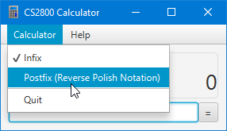
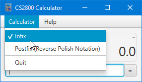
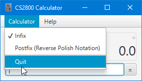
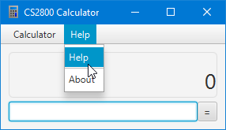
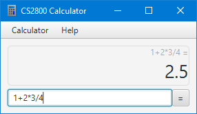

## How do I?

### Switch to Reverse Polish Notation

You may wish to switch to using postfix notation, or Reverse Polish Notation.
This is a notation where operators come after operands.

To switch over:

1. Click on the _Calculator_ dropdown.
2. Select the _Postfix_ option.

> Learn more about postfix on [Wikipedia, The Free Encyclopedia](https://en.wikipedia.org/wiki/Reverse_Polish_notation)

### Switch to Regular Notation (Infix Notation)

The CS2800 Calculator should be set to regular notation by default.
If you are returning from Postfix notation, you can easily switch back to Infix.

To switch back:

1. Click on the _Calculator_ dropdown.
2. Select the _Infix_ option.

### Quit the application

When finishing your calculations, you may wish to terminate the application and return back to the operating system.

To exit the application:

1. Click on the _Calculator_ dropdown.
2. Select the _Quit_ option.

Alternatively:

1. Press on your operating system's close button

### Get Help

If you are having difficulty using the application, you can view a help site, which opens in your default web browsing application.

To obtain help:

1. Click on the _Help_ dropdown.
2. Select the _Help_ option.

Alternatively:

1. Visit https://leondrolio.com/projects/calculator

## Examples

### BIDMAS Compliance

- Calculation: `1 + 2 * 3 / 4`
- Mode: `infix`
- Result: `2.5`

> Warning: The order of operations (BIDMAS) applies.
>
> 1. Brackets
> 2. Divide
> 3. Multiply
> 4. Add
> 5. Subtract
>
> To avoid the problems associated with unintended expressions, consider surrounding ambiguous portions with brackets.
