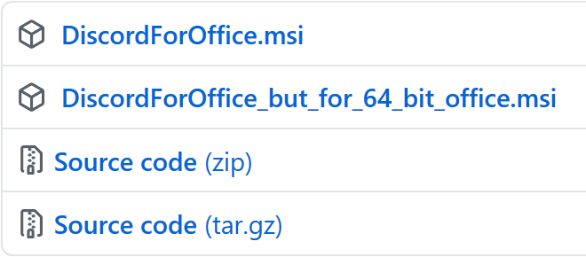
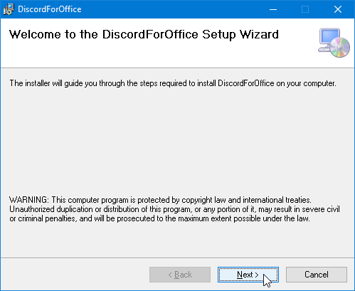
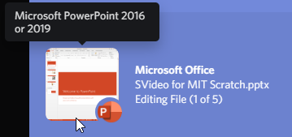
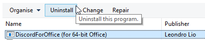

import Row from '~/components/Row.vue'
import Column from '~/components/Column.vue'

## Present to the world your love for work

Link Microsoft Office 2013, 2016, 2019 or Office 365 to DiscordForOffice, and _present_ yourself to the world!  
DiscordForOffice _excells_ in showing your friends key information from Microsoft Word, PowerPoint, Excel and Outlook.

## Requirements

<Row>
<Column>

One of:

- Microsoft Office 2013
- Microsoft Office 2016
- Microsoft Office 2019
- Microsoft Office 365

Both 32-bit and 64-bit versions are supported ✨

</Column>
<Column>

At least one of:

- Microsoft Word
- Microsoft PowerPoint
- Microsoft Excel
- Microsoft Outlook

</Column>
<Column>

Does not work with:

- Microsoft Access
- Microsoft Publisher
- Microsoft OneNote 2013
- Microsoft OneNote 2016
- Microsoft OneNote (Windows 10)
- Microsoft Teams
- Any other Microsoft product

</Column>
</Row>

## Installation

<Row>
<Column imager>

### Step 1

[Download DiscordForOffice](https://github.com/7coil/DiscordForOffice/releases)

The 32-bit version is recommended.  
Find out why the 64-bit version may not work for you [here](#i-have-a-64-bit-computer-and-i-installed-the-64-bit-version-of-discordforoffice-but-its-not-working)

</Column>
<Column imager>

### Step 2

Go through the installation

</Column>
<Column imager>

### Step 3

Your Discord Rich Presence (should) now be working!

If it doesn't work, [let us know](https://github.com/7coil/DiscordForOffice/issues/new) by creating an issue on GitHub

</Column>

</Row>

## Frequently asked Questions

### I have a 64-bit computer, and I installed the 64-bit version of DiscordForOffice, but it's not working!

You probably want to install the 32-bit version of DiscordForOffice as the version of Microsoft Office installed on your computer is the 32-bit version.

You may not mix and match DiscordForOffice and Microsoft Office bitness.

#### Fix

1. Open Control Panel, and uninstall **DiscordForOffice (for 64-bit Office)**
2. Go back to the download page, and download the 32-bit version of DiscordForOffice
3. Continue with the installation

### I have a 64-bit computer, and I have a 64-bit version of Microsoft Word. Which version of DiscordForOffice should I install?

Congratulations!
The 64-bit version of DiscordForOffice is for you!

### How do I uninstall DiscordForOffice?

Find it in the Control Panel or Settings app of your version of Microsoft Windows.

