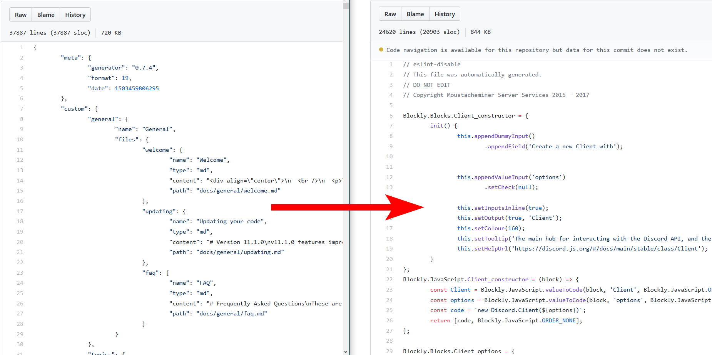
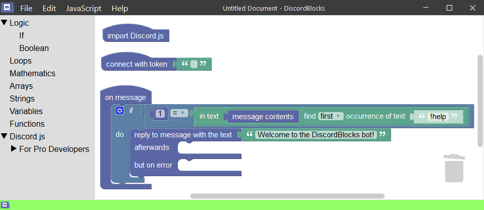

DiscordBlocks is a block based programming language for Discord.

This project started off as a joke in 2017, and is still only exists as a proof of concept to this day.

## Discord.js ❤ Blockly

Back in 2017, blocks were manually created by hand.
This was not helpful, as Discord.js would have many methods that would need to be implemented one by one. In the `1.0` release of DiscordBlocks alone, there are 26 files defining only 13 blocks.

Thankfully, the developers of Discord.js have `.json` files documenting all the methods, class variables and events for every class for every version of their software. With this JSON file, a generator could be created, converting the contents of the JSON file into a single large JavaScript blob.

In the latest version of DiscordBlocks, blocks are transformed from JSON into blocks within the user's web browser. This ensures that the web browser's JavaScript engine does not have to parse the large JavaScript file, increasing the page load time.

## React ❤ Blockly

In the latest version of DiscordBlocks, React/Redux is used to manage the state of the program. Blockly, however does not interact well with React.

In order to let both React and Blockly play in the same HTML document without `<iframe>`, the Blockly `
` is outside the React controlled environment. The footer was achieved by using CSS to push it below the Blockly `div`, whilst still being part of the React environment.

