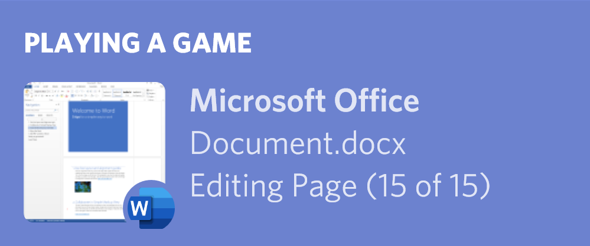

DiscordForOffice is a family of Microsoft Office 2013, 2016 and 2019 COM extensions which display rich information about what is happening in the application.



Supported Office Applications:
- Microsoft Word
- Microsoft Excel
- Microsoft PowerPoint
- Microsoft Outlook

Not (Yet) Supported Applications:
- Microsoft Visio

Not Supported Applications:
- Microsoft OneNote

## Installation
### Step 1: Add `office.terminal.ink` to your trusted internet sites
This sounds super weird and sketchy, but it is required for the VSTO installer to work.
This is because you are running unsigned code.

### Step 2: Download and install DiscordForOffice
[Downloads](https://github.com/Terminal/DiscordForOffice/releases)

## Licence
```
MIT License

Copyright (c) 2019 Leondro Lio

Permission is hereby granted, free of charge, to any person obtaining a copy
of this software and associated documentation files (the "Software"), to deal
in the Software without restriction, including without limitation the rights
to use, copy, modify, merge, publish, distribute, sublicense, and/or sell
copies of the Software, and to permit persons to whom the Software is
furnished to do so, subject to the following conditions:

The above copyright notice and this permission notice shall be included in all
copies or substantial portions of the Software.

THE SOFTWARE IS PROVIDED "AS IS", WITHOUT WARRANTY OF ANY KIND, EXPRESS OR
IMPLIED, INCLUDING BUT NOT LIMITED TO THE WARRANTIES OF MERCHANTABILITY,
FITNESS FOR A PARTICULAR PURPOSE AND NONINFRINGEMENT. IN NO EVENT SHALL THE
AUTHORS OR COPYRIGHT HOLDERS BE LIABLE FOR ANY CLAIM, DAMAGES OR OTHER
LIABILITY, WHETHER IN AN ACTION OF CONTRACT, TORT OR OTHERWISE, ARISING FROM,
OUT OF OR IN CONNECTION WITH THE SOFTWARE OR THE USE OR OTHER DEALINGS IN THE
SOFTWARE.
```

## 2016 or 2019?
In the 2019 edition of Microsoft Office, Microsoft kept the major version number of Office at 16, instead of incrementing to 17.
This is a minor problem which makes it difficult to differentiate between Office 2016 and 2019.

A solution is yet to be found.
